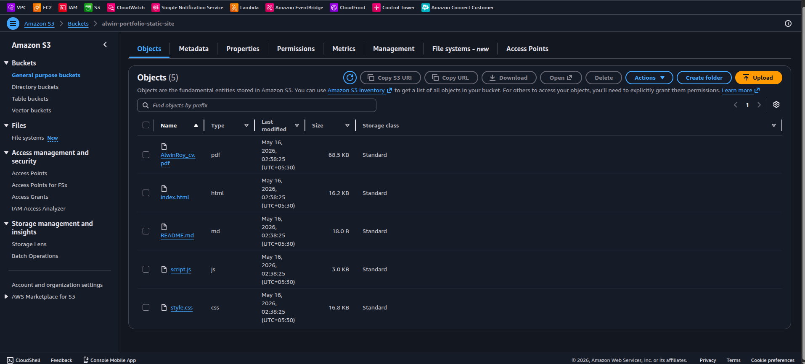
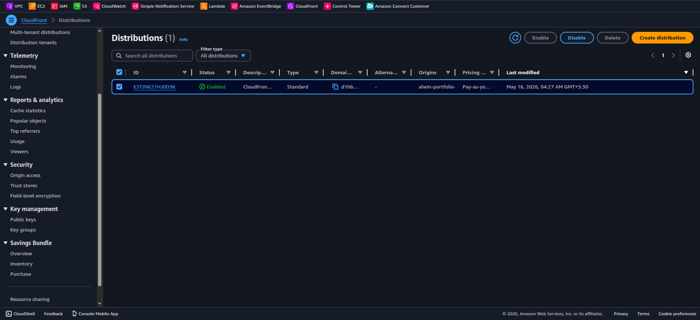
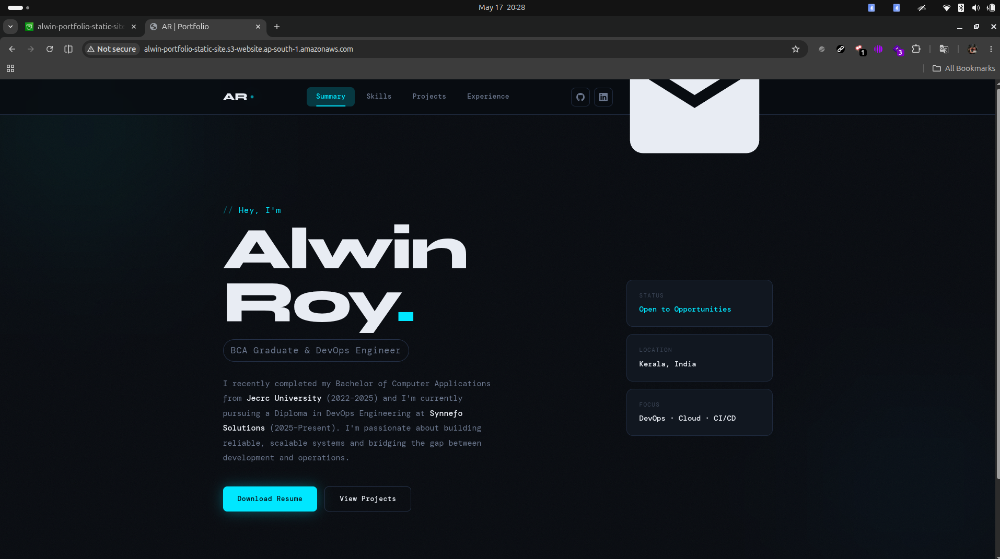

# ☁️ AWS Static Website Hosting — Portfolio Project

> A production-style static website deployed on **Amazon S3** and served globally via **Amazon CloudFront CDN**, built as part of my DevOps learning journey.

---

## 📌 Project Overview

This project demonstrates how to host a static portfolio website on AWS infrastructure using core cloud services — S3 for storage, CloudFront for global content delivery, and IAM bucket policies for public access control.

The goal was to move beyond local hosting and understand how real-world static websites are deployed and served at scale using AWS managed services.

---

## 🏗️ Architecture

```
User (Browser)
      │
      ▼
┌─────────────────────┐
│   CloudFront CDN    │  ← Global Edge Locations (HTTPS + Caching)
└─────────────────────┘
      │
      ▼
┌─────────────────────┐
│   Amazon S3 Bucket  │  ← Static Website Hosting (HTML, CSS, JS, PDF)
└─────────────────────┘
      │
      ▼
┌─────────────────────┐
│   IAM Bucket Policy │  ← Public Read Access Control
└─────────────────────┘
```

---

## 🛠️ AWS Services Used

| Service | Purpose |
|---------|---------|
| Amazon S3 | Stores and serves static website files |
| Amazon CloudFront | CDN for global delivery, HTTPS, and edge caching |
| IAM / Bucket Policy | Controls public read access to S3 objects |
| AWS CLI | Used for deployment and bucket management |

---

## 📁 Repository Structure

```
aws-static-website-hosting/
│
├── README.md                             # Project documentation (this file)
├── .gitignore                            # Prevents sensitive/unnecessary files from uploading
│
├── website/                              # Deployable frontend files
│   ├── index.html
│   ├── style.css
│   ├── script.js
│   ├── AlwinRoy_cv.pdf
│
├── screenshots/                       # Visual proof of setup (for portfolio)
│   ├── cli command for sync.png
    ├── cloud_front distribution.png
    ├── cloudfront_origin.png
    ├── s3_bucket properties.png
    ├── s3-bucket_listed.png
│   ├── s3_static enabled.png
    ├── bucket policy.png
│   └── website-output.png
│
├── diagrams/                   # Architecture diagrams
│   └── architecture.png
```

---

## 🚀 Deployment Steps (Summary)

> **Note:** Steps 1–3 were configured via the AWS Management Console (UI). Step 4 was executed using the AWS CLI for deployment automation practice.

### 1. Create S3 Bucket (AWS Console)

- Navigate to S3 → Create Bucket
- Bucket name: `alwin-portfolio-static-site`
- Region: `ap-south-1` (Mumbai)
- Block public access: **disable** (required for static hosting)

### 2. Enable Static Website Hosting (AWS Console)

- S3 → Bucket → Properties → Static Website Hosting → **Enable**
- Index document: `index.html`
- Error document: `index.html`

### 3. Apply Bucket Policy — Public Read (AWS Console)

- S3 → Bucket → Permissions → Bucket Policy
- Pasted the public read policy (see [`aws-cli/bucket-policy.json`](aws-cli/bucket-policy.json))

### 4. Sync Website Files to S3 (AWS CLI)

```bash
aws s3 sync ./website s3://alwin-portfolio-static-site \
  --exclude ".git/*"
```

### 5. Create CloudFront Distribution (AWS Console)

- Origin: S3 bucket static website endpoint
- HTTPS: Enabled (via CloudFront default certificate)
- Caching: Default CloudFront policy


---

## 🌐 Live Demo

| Access Method | URL |
|---------------|-----|
| CloudFront URL | `d1hbdac1e4e56e.cloudfront.net` |
| S3 Website Endpoint | `http://alwin-portfolio-static-site.s3-website.ap-south-1.amazonaws.com` |

---

## 📸 Screenshots

| S3 Bucket | CloudFront Distribution | Live Website |
|-----------|-------------------------|--------------|
|  |  |  |

---

## 💡 Key Concepts Learned

- **S3 Static Hosting** — Serving HTML/CSS/JS directly from object storage without a web server
- **Bucket Policies** — JSON-based IAM policies to control who can access S3 objects
- **CloudFront CDN** — How edge locations cache and serve content globally with low latency
- **HTTPS Delivery** — CloudFront provides SSL/TLS without managing certificates manually
- **AWS CLI** — Deploying and managing cloud infrastructure from the terminal
- **Cost Awareness** — Monitoring billing, setting alerts, and cleaning up unused resources

---

## ⚠️ Issues Faced & Fixed

| Problem | Root Cause | Fix |
|---------|-----------|-----|
| `403 AccessDenied` on S3 URL | Missing public read bucket policy | Applied correct bucket policy JSON |
| `.git/` folder uploaded to S3 | `sync` without exclude flag | Added `--exclude ".git/*"` to sync command |
| CloudFront serving old files | Browser/edge cache not cleared | Created CloudFront invalidation |


---

## 🔮 Future Improvements

- [ ] Add custom domain using Route 53 + ACM SSL certificate
- [ ] Set up CI/CD pipeline (GitHub Actions → S3 auto-deploy on push)
- [ ] Enable S3 access logging for traffic monitoring
- [ ] Add CloudWatch billing alarm for cost monitoring
- [ ] Implement S3 versioning for rollback capability

---

## 📞 Connect

[](https://linkedin.com/in/alwinroy)
[](https://github.com/AlwinRoy777)
[](https://AlwinRoy777.github.io/Alwin-Portfolio/)

---
